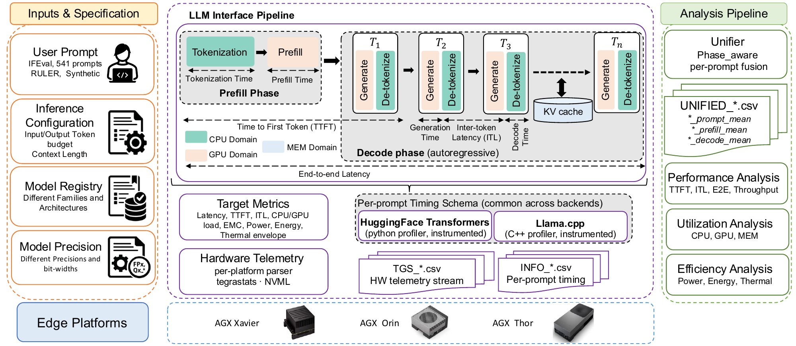
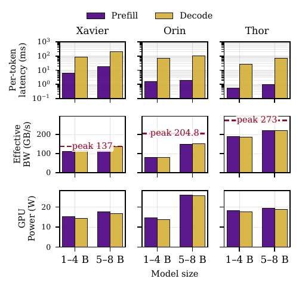
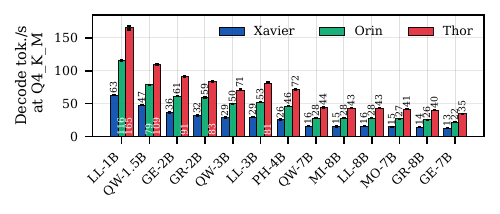

# Hydra — Phase-Aware Workload Characterization of LLM Inference on Edge SoCs

[](https://doi.org/10.5281/zenodo.21844843)
[](LICENSE)
[](https://iiswc.org/iiswc2026/)


Hydra (named after the largest constellation in the sky) is a
**common-schema, phase-aware measurement framework** for LLM inference on
edge SoCs. It instruments two structurally different inference
backends — **HuggingFace Transformers** (Python) and **llama.cpp** (C++/GGML)
— with one per-prompt timing schema, fuses that timing with high-resolution
`tegrastats`/NVML telemetry, and attributes CPU, GPU, memory, power, energy,
and thermal behavior to the **prefill** and **decode** phases of every prompt.

This repository is the artifact of the IISWC 2026 paper
*"Hydra: Phase-Aware Workload Characterization of LLM Inference across Edge
SoC Generations, Backends, and Quantization Levels"*, and ships the complete
released measurement corpus: **107,110 per-prompt records** covering three
NVIDIA Jetson generations (AGX Xavier / Orin / Thor), 13 instruction-tuned
LLMs (1–8 B) from seven families, five execution formats
(`bf16`, `F16`, `Q8_0`, `Q6_K`, `Q4_K_M`), and input/output-length sweeps.



## 🔍 Why phase-aware?

Aggregate latency hides where time, power, and energy actually go. Three
findings from the paper that only a phase-aware, cross-backend view exposes:

- **A backend can win end-to-end while being slower per token.** On Thor,
  HuggingFace generates a token in 33 ms but *delivers* it in 63.5 ms
  (CPU-side orchestration + de-tokenization); llama.cpp generates in 58.5 ms
  and delivers in 58.6 ms — runtime structure, not kernel speed, decides
  latency.
- **Power is not monotonic in bit-width.** `Q6_K` draws *more* power and runs
  hotter than `Q8_0` on every platform we measured — quantization format is
  a compute/memory tradeoff, not just a footprint knob.
- **The same GPU-utilization number means different things across SoC
  generations.** An identical workload reads 27 % on Orin and 86 % on Thor
  because of DVFS policy — raw utilization is not cross-platform comparable.

<p align="center">
  
  
</p>

## 🚀 Quick start — reproduce the paper from the released corpus

No GPU or Jetson needed; any Linux/macOS machine, ~5 minutes:

```bash
git clone https://github.com/amirtaherin/hydra.git
cd hydra
python3 -m venv .venv && source .venv/bin/activate
pip install pandas numpy matplotlib seaborn
bash scripts/ae_reproduce.sh
```

This reassembles the corpus shipped under `data/unified/` (split xz tarball →
286 unified CSVs, ~430 MB), regenerates every data-derived figure
(Figs. 1, 3–7) and table (Tables 4–7) of the paper, and prints the
output→paper mapping. Committed reference outputs live in
`expected_results/` — `diff` your outputs against them.

See **[AE_README.md](AE_README.md)** for the full artifact-evaluation guide,
including the on-device measurement spot-check (`scripts/ae_quick.sh`).

## 📊 The corpus

| | |
|---|---|
| Records | 107,110 per-prompt rows (25 timing fields + phase-attributed telemetry; 349–419 columns depending on platform/backend) |
| Main sweep | 190 configurations = 3 platforms × 2 backends × 5 formats × 13 models (− 5 Xavier F16 load failures) × 541 IFEval prompts |
| Sensitivity | S1 input-length sweep (RULER, 1k/3k/5k) and S2 output-length sweep (1k/3k/5k) on Orin + Thor |
| Phases | every telemetry signal aggregated over prompt / prefill / decode windows |

## ⚡ Measure your own workloads (Jetson)

The collection pipeline runs on NVIDIA Jetson. The llama.cpp profiler is
built from the pinned `llama.cpp` submodule, so initialize submodules first
(not needed for the analysis-only quick start above):

```bash
git submodule update --init --recursive
python3 -m venv --system-site-packages .venv && source .venv/bin/activate
pip install -r scripts/requirements_orin.txt      # or _xavier / _thor
bash scripts/run_hf_experiments.sh          # HuggingFace backend
bash scripts/build_llamacpp_profiler.sh     # compile llama.cpp profiler (auto CUDA arch)
bash scripts/run_llamacpp_experiments.sh    # llama.cpp backend
bash scripts/run_unifiers.sh <results_root> # fuse timing + telemetry
```

Both runner scripts detect the platform from the hostname, pre-download all
models, and have **resume support**: output CSVs are checked against the
expected prompt count, complete runs are skipped, and partial runs are
deleted and redone — safe to Ctrl+C and re-run across long sessions.

| Platform | JetPack | CUDA | GPU arch | HF dtype | llama.cpp dtypes |
|----------|---------|------|----------|----------|------------------|
| AGX Xavier | 5 | 11.4 | sm_72 | bfloat16 | F16, Q8_0, Q6_K, Q4_K_M |
| AGX Orin | 6 | 12.6 | sm_87 | bfloat16 | F16, Q8_0, Q6_K, Q4_K_M |
| AGX Thor | 7 | 13.x | sm_110 | bfloat16 | F16, Q8_0, Q6_K, Q4_K_M |

### 🛠️ Building the llama.cpp profiler

```bash
# prerequisites (once per board)
sudo apt install cmake build-essential wget
export PATH=/usr/local/cuda/bin:$PATH        # nvcc must be on PATH

git submodule update --init --recursive      # pinned llama.cpp
bash scripts/build_llamacpp_profiler.sh      # ~15-30 min on-device
```

The build script detects the platform from the hostname and selects the
CUDA architecture automatically (see table above). Overrides and
troubleshooting:

- **`nvcc: command not found`** — the CUDA toolkit isn't on your PATH;
  `export PATH=/usr/local/cuda/bin:$PATH` (add to `~/.bashrc`).
- **Thor with CUDA < 13.0** — build with `CUDA_ARCH=101 bash
  scripts/build_llamacpp_profiler.sh`.
- **Non-AGX Jetson / other GPU** — set `CUDA_ARCH=<your sm>` explicitly.
- The binary lands at `inference/llamacpp_profiler/build/cpp_api_pipeline`;
  `run_llamacpp_experiments.sh` also invokes this build automatically if
  the binary is missing.

> **PyTorch on Jetson:** do *not* `pip install torch` — PyPI's aarch64 wheel
> is CPU-only. Use the NVIDIA JetPack build (pre-installed with JetPack /
> jetson-containers); the venv above uses `--system-site-packages` so the
> system torch is visible. The requirements files intentionally exclude
> torch for this reason.

### 🔧 Running a single model manually

```bash
# HF profiler — single model, 3 prompts
python3 -m inference.hf_profiler.main \
  --input inputs/prompts/input_data.jsonl \
  --model-names inputs/models/models.json \
  --dtype bfloat16 --max-new-tokens 500 \
  --max-prompts 3 --result-dir results/

# llama.cpp profiler — single model, 3 prompts
./inference/llamacpp_profiler/build/cpp_api_pipeline \
  --input inputs/prompts/input_data.jsonl \
  --model-names inputs/models/models.json \
  --dtype Q4_K_M --max-new-tokens 500 \
  --max-prompts 3 --result-dir results/
```

Adding a model or precision is a registry edit (`inputs/models/models.json`,
shared by both profilers via `hf_path` + `gguf_path`); adding a platform
means writing a `tegrastats` parser (`inference/telemetry/`).

## 🗺️ Repository map

```
inputs/
  prompts/                    IFEval prompts + S1/S2 sensitivity sets (see provenance README)
  models/                     model registry (13 LLMs, 7 families)
inference/
  hf_profiler/                HuggingFace Transformers profiler (Python)
  llamacpp_profiler/          llama.cpp profiler (C++, pinned llama.cpp submodule)
  telemetry/                  tegrastats control + per-platform parsers (Xavier/Orin/Thor)
analysis/
  unifier/                    fuses INFO (timing) + TGS (telemetry) -> UNIFIED records
  performance / utilization / sensitivity / motivation / efficiency_tables
                              the paper's figure & table generators
  extras/                     additional exploratory plot families
scripts/                      experiment drivers, ae_reproduce.sh, ae_quick.sh
data/unified/                 the released corpus (split xz tarball + README)
expected_results/             committed reference figures/tables for verification
```

## 📖 Citation

Accepted at **IISWC 2026**. BibTeX will be added with the camera-ready;
until then, please cite the paper title above and this repository.

## 🤝 Contributing

Contributions are welcome — new models, platforms, telemetry parsers, or
analysis views. Please open an issue to discuss larger changes, and submit
a pull request.

## 📬 Contact

For questions or feedback, please open an issue on this repository.

## 📄 License

MIT — see [LICENSE](LICENSE).
